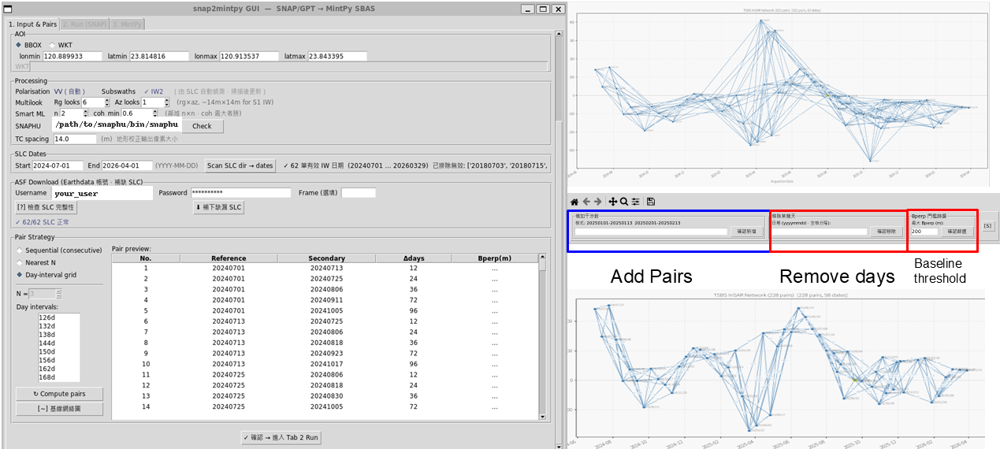
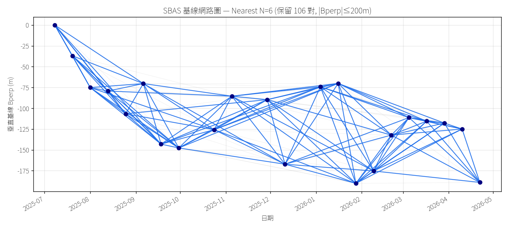
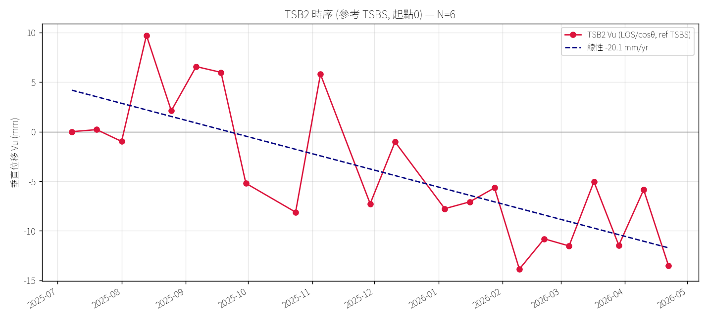

# snap2mintpy

*[English](README.md)*

Sentinel-1 TOPS SBAS 時間序列分析的一站式 GUI 工具，串起從原始 IW SLC 到地表形變速度場的完整流程：

**Sentinel-1 TOPS SLC → SNAP GPT 干涉處理 → SNAPHU 解纏 → MintPy SBAS 反演**

全部操作集中在單一 Tkinter GUI。繁重的干涉圖處理可透過 SSH 分散到多台工作站，各節點共用同一份專案目錄。另有一組命令列工具，涵蓋叢集監控、GNSS 交叉驗證、角反射器分析，以及以 ASF HyP3 雲端運算取代本機 SNAP 的替代管線。


---

## 功能特色

### GUI（`snap2mintpy_gui.py`）— 五個分頁

1. **輸入與配對** — 設定專案、SNAP 安裝路徑、SLC/DEM 路徑與 AOI；從 ASF 下載 SLC（讀取 `~/.netrc`）；以 Nearest-N 或自選天數設計 SBAS 網路，並套用垂直基線篩選；預覽基線網路圖、手動選擇 IW 子帶。
2. **執行 SNAP + 叢集** — 執行 SNAP GPT 管線（split → 干涉圖 → SNAPHU → 地理編碼）；單機／叢集模式切換；即時進度條與逐機 log 分頁；SSD swapfile 管理；work-stealing 派工。
3. **MintPy** — 編輯 `smallbaselineApp.cfg`，透過內建終端一鍵執行 `smallbaselineApp.py`，並將結果匯出成 GeoTIFF。
4. **GNSS 比對** — 以 GNSS 測站交叉驗證 InSAR 結果（垂直分量與 LOS 投影）。
5. **累積變形** — 以多面板網格加上動畫 GIF 呈現累積變形量地圖。



### 命令列工具

- **`cluster_progress.py`** — 獨立的叢集進度監控。讀取 `dist_config.json` 與各 worker 狀態檔，顯示總進度條、每台主機目前處理的對與步驟、速率與 ETA。可在任一節點執行，不依賴 GUI。
- **`hyp3_burst_to_mintpy.py`** — 替代管線，將 Sentinel-1 burst InSAR 交給 ASF HyP3 雲端運算：以 `asf_search` 找 burst SLC、配對、送 HyP3 算干涉圖、多視，再轉為 MintPy 格式。
- **`analyze_N.py` / `report_N.py`** — Nearest-N 網路比較實驗。`analyze_N.py` 以 `modify_network.py --max-conn-num N` 對既有 `ifgramStack.h5` 取網路子集，重跑反演、DEM 誤差校正與速度估計；`report_N.py` 繪製基線網路圖、參考校正後的垂直速度場，以及各點時間序列。
- **`gnss_compare.py`** — GNSS↔InSAR 比對核心邏輯（也被 GUI 的 GNSS 分頁與累積變形分頁呼叫）。讀取 GNSS 試算表與 MintPy `timeseries.h5`，比對垂直位移與 LOS 投影。
- **`cr_report.py`** — 角反射器效益佐證報告產生器，含高程校正定位與 SLC 共登記。
- **`view_basemap.py`** — 將 `velocity.h5` / `timeseries.h5` 疊在底圖（衛星／OSM／地形）上並繪出干涉網路的視覺化工具。
- **`analyze_failures.py`** — 掃描 worker log，彙整失敗的對與其原因。
- **`make_velocity_deramp.sh`** — 以 MintPy CLI 產出 deramp 版速度產品的 shell 包裝。

---

## 處理管線

SNAP 階段每個步驟執行一張 GPT graph，圖檔模板放在 `snap2stamps/graphs/`。

1. **Split** — 對每個 (日期, IW) 做 TOPSAR-Split + Apply-Orbit，跨對重用。
2. **干涉圖 + Deburst** — 共登記、生成干涉圖、去 burst 邊界。
3. **Goldstein 濾波 + 多視** — 相位濾波與多視（multilook）。
4. **Smart ML** — 補回多視留下的 NaN 空洞（`scipy.interpolate.griddata` + 高斯平滑），並輸出三面板 QC PNG。
5. **SNAPHU 解纏** — 三步驟：export → 執行 `snaphu` → import。
6. **地形校正** — 將纏繞與解纏相位地理編碼為 `*_tc.dim` / GeoTIFF。
7. **MintPy 格式轉換** — 把地理編碼產品轉成 MintPy 輸入堆疊。
8. **`smallbaselineApp.py`** — SBAS 反演：載入資料 → 參考點 → 網路反演 → 速度。

選用的後續分析：DEM 誤差校正、deramp 速度、GNSS 比對、累積變形地圖，以及 Nearest-N 網路比較。



---

## 環境需求

### 外部軟體（非 Python 套件）

| 軟體 | 用途 |
|---|---|
| **ESA SNAP**（`gpt`） | GPT graph 引擎：split／共登記／干涉圖／濾波／地形校正 |
| **SNAPHU** | 相位解纏（Stanford） |
| **MintPy**（`smallbaselineApp.py` 等） | SBAS 時間序列反演（裝在 conda 環境內） |
| **GDAL**（`osgeo.gdal` Python binding） | DEM 下載與座標轉換 |
| **python3-tk** | Tkinter GUI 工具組（系統套件） |
| **ssh** 用戶端 | 叢集派工、監控與清理 |

工具會自動在常見安裝路徑偵測 `gpt` 與 `snaphu`，並在 `~/miniconda3/envs/*` 下偵測含 MintPy 的 conda 環境；也可在 GUI 內自訂路徑。

### Python 套件

**必要：** `asf_search` `h5py` `numpy` `scipy` `matplotlib` `pandas` `openpyxl` `rasterio`

**選用：** `contextily` `pyproj`（`view_basemap.py` 的底圖疊加）、`hyp3_sdk`（僅 HyP3 替代管線需要）。

`scipy`、`rasterio`、`osgeo` 缺席時會優雅降級（跳過 gap-fill、GeoTIFF 匯出時提示安裝、DEM 步驟記 log 後略過）。

---

## 安裝步驟

### 1. Miniconda（Python 環境管理）

```bash
wget https://repo.anaconda.com/miniconda/Miniconda3-latest-Linux-x86_64.sh
bash Miniconda3-latest-Linux-x86_64.sh -b -p ~/miniconda3
echo 'export PATH="$HOME/miniconda3/bin:$PATH"' >> ~/.bashrc
source ~/.bashrc
conda --version
```

### 2. MintPy 環境

```bash
conda create -n mintpy python=3.10 -y
conda activate mintpy
conda install -c conda-forge mintpy -y
smallbaselineApp.py --version
```

### 3. ESA SNAP

從 <https://step.esa.int/main/download/snap-download/> 下載 Linux 安裝檔後：

```bash
bash esa-snap_sentinel_unix_9_0_0.sh          # 預設路徑：~/esa-snap
~/esa-snap/bin/gpt --version                   # 確認 gpt
~/esa-snap/bin/snap --nosplash --nogui --modules --update-all   # 更新 S1 外掛
```

GUI 會探測 `~/esa-snap/bin/gpt`、`/opt/esa-snap/bin/gpt`、`/opt/snap/bin/gpt` 與 `$PATH`。

### 4. SNAPHU

從 Stanford 原始碼編譯，或以套件管理器安裝。GUI 會探測 `~/tools/snaphu/bin/snaphu`、`/usr/local/bin/snaphu`、`/usr/bin/snaphu`、`/opt/snaphu/bin/snaphu`。

### 5. 本 repo

```bash
git clone https://github.com/YOUR_USERNAME/snap2mintpy.git
cd snap2mintpy
sudo apt install -y python3-tk        # 若系統缺 Tkinter
python3 snap2mintpy_gui.py
```

必要的 Python 套件裝在你的 base 或 MintPy 環境內。缺套件時，GUI 首次用到會嘗試 `pip install --user`。

---

## 憑證設定

本工具**只讀取**你放在標準檔案裡的憑證，絕不將帳號密碼另存或外傳。

### NASA Earthdata（`~/.netrc`）— 供 ASF 下載與 HyP3 使用

到 <https://urs.earthdata.nasa.gov> 免費註冊帳號後，建立 `~/.netrc`：

```
machine urs.earthdata.nasa.gov
    login YOUR_USERNAME
    password YOUR_PASSWORD
```

```bash
chmod 600 ~/.netrc      # 必要，否則檔案不生效
```

ASF SLC 下載與 HyP3 管線都會讀這個檔。GUI 的密碼欄若有填，也只存活於當次 session。

### SSH 免密金鑰登入（叢集）— 叢集模式必要

所有 SSH 呼叫都帶 `-o BatchMode=yes`，即**停用密碼互動**：若沒設好金鑰式登入，叢集指令會直接失敗。只需設定一次：

```bash
ssh-keygen -t ed25519 -C "insar-cluster"
ssh-copy-id -i ~/.ssh/id_ed25519 your_user@192.168.1.101
ssh-copy-id -i ~/.ssh/id_ed25519 your_user@192.168.1.102
```

接著把主機別名寫進 `~/.ssh/config`：

```
Host worker01
    HostName 192.168.1.101
    User your_user
    IdentityFile ~/.ssh/id_ed25519

Host worker02
    HostName 192.168.1.102
    User your_user
    IdentityFile ~/.ssh/id_ed25519
```

GUI 會讀取 `~/.ssh/config`，把每個 `Host` 別名列成勾選項（本機固定排在最前）。

### sudo（選用）

`SNAP2MINTPY_SUDO_PASS` 是選用的環境變數，僅供 pip 安裝的後備方案與 swapfile 管理使用。不設也可以——GUI 會優先用 `pip install --user`，swap 則改為手動管理。

---

## 叢集設定

叢集模式由跑 GUI 的機器（主控端）透過 SSH 在各 worker 節點啟動 `snap2mintpy_worker.py`。每個 worker 會 import 同一份 `snap2mintpy_gui.py`，並在同一份專案目錄上作業，因此各節點的設定必須一致。

各節點需求：

1. **共享儲存** — 專案目錄（例如放在共享 NFS/CIFS 掛載下）在每個節點都掛在**相同路徑**。
2. **相同 repo 路徑** — `snap2mintpy` 在每個節點都位於相同路徑（worker 會直接 import）。
3. **相同 Python 環境** — 每個節點都能 `import snap2mintpy_gui` 並執行 MintPy。
4. **已裝 SNAP + SNAPHU** — 各節點的 `gpt` 與 `snaphu` 可執行，透過 `$PATH` 或由遠端指令 source 的 `~/FastISCE.config` 提供。
5. **SSH 金鑰登入 + `~/.ssh/config` 別名**（見上一節）。
6. **JVM 記憶體調校** — 依各機 RAM 調整 `gpt.vmoptions` 的 `-Xmx` 與 `tileCache`。worker 會依 `/proc/meminfo` 自動算出安全的 `tileCache`（約 RAM 的 12%，下限 4 GB、上限 24 GB），並覆寫共用 config 的值。
7. **（選用）swapfile** 以防大 frame OOM：

   ```bash
   sudo fallocate -l 100G ~/snap_swap.img
   sudo chmod 600 ~/snap_swap.img
   sudo mkswap ~/snap_swap.img
   sudo swapon ~/snap_swap.img
   ```

主控端把配對切塊分派到各主機，並支援 **work-stealing**（閒置主機認領剩餘的對）。只有第一台負責產 DEM，以避免競態。每個 worker 以 atomic 寫入 `logs/worker_<label>.json` 狀態檔，主控端（或任一節點上的 `cluster_progress.py`）輪詢該檔追蹤進度。GUI 關閉時會清理殘留的遠端行程。

---

## 快速上手

單機、一個小 AOI：

```bash
conda activate mintpy      # 或任何裝好必要套件的環境
python3 snap2mintpy_gui.py
```

1. **Tab 1（輸入與配對）** — 設定專案目錄、SNAP 安裝路徑、SLC/DEM 路徑與 AOI；必要時下載 SLC，選定 Nearest-N 值，預覽基線網路。
2. **Tab 2（執行 SNAP）** — 保持叢集模式關閉，按開始，看管線依序跑 split → 干涉圖 → SNAPHU → 地理編碼。
3. **Tab 3（MintPy）** — 檢視 `smallbaselineApp.cfg`，執行 `smallbaselineApp.py`，把速度場匯出成 GeoTIFF。



---

## 授權與致謝

本 repo 以 **[CC BY-NC-SA 4.0](LICENSE.md)**（創用 CC 姓名標示-非商業性-相同方式分享 4.0 國際）授權。

`snap2stamps/graphs/` 內的 SNAP GPT graph 模板衍生自 Jose Manuel Delgado Blasco 等人的 [snap2stamps](https://github.com/mdelgadoblasco/snap2stamps)，同樣以 CC BY-NC-SA 4.0 釋出。

感謝：

- **ESA SNAP** — Sentinel-1 TOPS 干涉處理
- **SNAPHU** — 統計成本相位解纏（Stanford）
- **MintPy** — SBAS 時間序列分析（insarlab）
- **ASF** — Sentinel-1 資料存取與 HyP3 隨選運算
